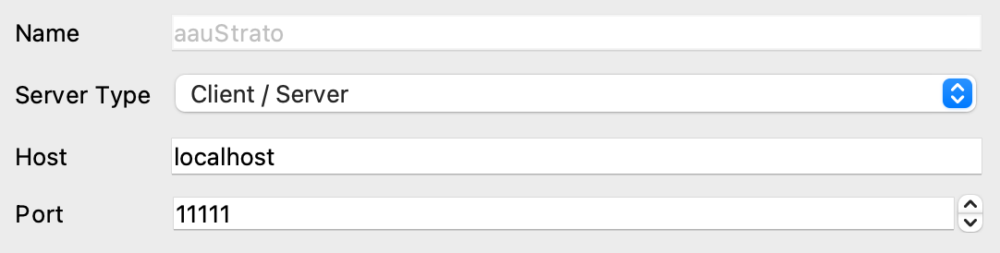

# OpenFOAM on AAU Strato Computing Facilities

This guide explains how to get started with OpenFOAM using the AAU Strato computing facilities. Also, it highlights how to connect to a headless ParaView server running on the OpenStack instance.

### Take note of important variables
We will be referring to three variable in this guide:

``<AAU-EMAIL>``, which is your AAU email, e.g.`name@student.aau.dk`

``<IP-OF-INSTANCE>``, which is simply the ip-address of the instance running that we start in step 1

``<PATH-TO-KEY-FILE>``, which is the full path to your key file that will be created in step 1

## 1. Starting a new instance in OpenFOAM

a) Browse to [https://strato-new.claaudia.aau.dk](https://strato-new.claaudia.aau.dk) and sign-in using your AAU credentials.

b) More information follows shortly...

## 2. Connecting via ssh
Connect to the instance by (remember to change `<IP-OF-INSTANCE>` and `<PATH-TO-KEY-FILE>`):
```shell
ssh -L 11111:localhost:11111 ubuntu@<IP-OF-INSTANCE> -i <PATH-TO-KEY-FILE>
```
After entering your password, you will be connected to the instance.

Note: `-L 11111:localhost:11111` prepares our connection for ParaView connections later - sleek!
### Optional: Creating a ssh configuration file

a) If you don't want to enter the command in step 2 every time you want to log in, you may create a ssh config file. This file should be in``$HOME/.ssh/config``. To create it:
```shell
mkdir -p $HOME/.ssh
touch $HOME/.ssh/config
```

b) Now, open the``config``file in your text editor and add (again remember to change `<IP-OF-INSTANCE>` and `<PATH-TO-KEY-FILE>`):
```shell
Host aauStrato
        HostName <IP-OF-INSTANCE>
        User ubuntu
        IdentityFile <PATH-TO-KEY-FILE>
        LocalForward 11111 localhost:11111
```

c) Restart the terminal.

d) You can now login by simply typing:
```shell
ssh aauStrato
```

## 3. Sourcing OpenFOAM and starting headless ParaView server
a) If you started your instance based on the OpenFOAM image in step 1, you have to source your preferred OpenFOAM version. You will be greeted with a message showing which versions of OpenFOAM are available. To source OpenFOAM v2106 simply type ``of2106``.

b) To start the headless ParaView server simply type ``pvserver``. The ParaView server is now listening for connections.
## 4. Transferring files to/from instance
Files to/from the OpenStack instance can transferred by a sftp client. I suggest installing [FileZilla](https://filezilla-project.org/), which is free and available on Windows/macOS and most Linux systems. You then connect using:

- Protocol: sftp
- Host: ``<IP-OF-INSTANCE>``
- Logon type: Key file
- User: ubuntu
- Key file: ``<PATH-TO-KEY-FILE>``

## 5. Connecting to the ParaView server running on the instance
If you started the ParaView server in step 3, you can connect to it using your local ParaView client by "File" --> "Connect..." and then add a new server with the following information:



Note: The connection may take a few seconds to establish.